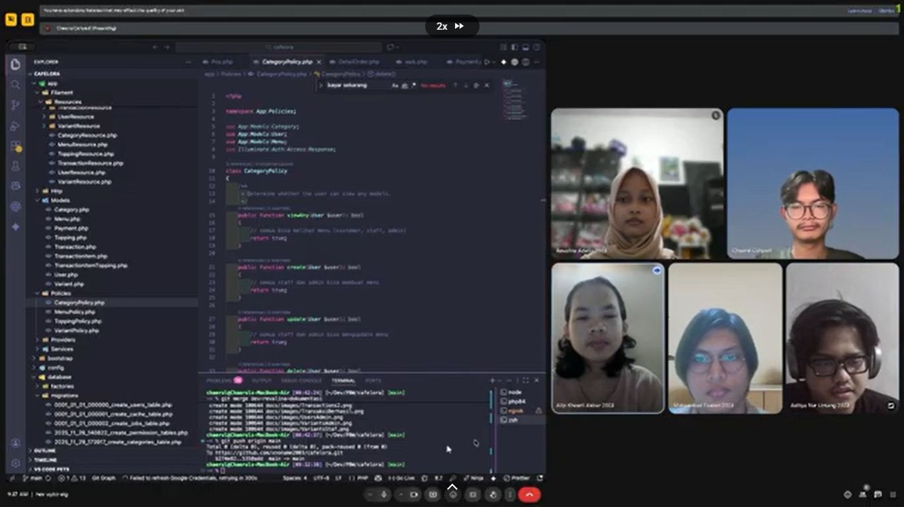

---
# Agenda Pekerjaan 

---
## Agenda Pekerjaan di GitHub

| No. | Nama               | Fitur                                        | Deskripsi Progres                                                                                       | Tanggal Push GitHub |
|-----|--------------------|----------------------------------------------|---------------------------------------------------------------------------------------------------------|---------------|
| 1.  | Chaerul Cahyadi    | Tidak Ada                                                       | Inisialisasi Cafelora                                                                                     | 26/11/2025        |
| 2.  | Aditya Nur Lintang | Manajemen User dan Role                                         | Setup Laravel + Filament, Implementasi Role + Policy (Admin, Staff, Customer)                                                                                    | 26/11/2025        |
| 3.  | Chaerul Cahyadi    | Tidak Ada                                                       | Fix Error Implementasi Role Policy                                                                                       | 27/11/2025        |
| 4.  | Chaerul Cahyadi    | Menu Management                                                 | ERD dan Struktur Tabel Sistem Cafelora                                                                                     | 29/11/2025        |
| 5.  | Chaerul Cahyadi    | Tidak Ada                                                       | Update .env.example                                                                                      | 29/11/2025        |
| 6.  | Chaerul Cahyadi    | Tidak Ada                                                       | Update Policy dan Crud Menu Management                                                                                   | 30/11/2025        |
| 7.  | Chaerul Cahyadi    | Tidak Ada                                                       | Fix Policy                                                                                       | 30/11/2025        |
| 8.  | Alip Khoeril Akbar | Frontend (Pelanggan)                                            | Membuat Frontend Untuk Pelanggan Melihat Daftar Menu dan Sedikit Penyesuaian Code Pada MenuResource.php                                                       | 30/11/2025        |
| 9.  | Chaerul Cahyadi    | Tidak Ada                                                       | Update ERD Documentation and Replace Image                                                                                        | 6/12/2025         |
| 10. | Chaerul Cahyadi    | Tidak Ada                                                       | Fix Landing Page and ERD                                                                                          | 6/12/2025         |
| 11. | Alip Khoeril Akbar | Frontend (Pelanggan)                                            | Modifikasi Tampilan Frontend Pelanggan                                                                                    | 6/12/2025         |
| 12. | Alip Khoeril Akbar | Frontend (Pelanggan)                                            | Membuat Fitur Search Pada Halaman Frontend (Pelanggan) Berdasarkan Nama menu, Harga, Kategori                                                                        | 7/12/2025         |
| 13. | Alip Khoeril Akbar | Frontend (Pelanggan)                                            | Membuat Fitur Search Pada Halaman Frontend (Pelanggan) Berdasarkan Nama menu, Harga, Kategori                                                                        | 8/12/2025         |
| 14. | Alip Khoeril Akbar | Frontend (Pelanggan)                                            | Fix URL Filter Frontend (Pelanggan)                                                                                  | 10/12/2025        |
| 15. | Muhammad Fauzan    | Menu Transaction Management                                     | Transactions dan POS Kasir                                                                                        | 10/11/2025        |
| 16. | Revalina Adelia    | Dokumentasi                                                     | Menambahkan Dokumentasi Fitur, Tampilan, Instalasi, dan Agenda                                                                                       | 12/12/2025        |
| 17. | Alip Khoeril Akbar | Membuat Halaman Detail Menu dari Setiap Menu                    | Membuat Halaman Detail Menu dari Setiap Menu                                                                                         | 13/12/2025        |
| 18. | Alip Khoeril Akbar | Membuat Section Rekomendasi Menu (BestSeller) dan Fix Responsif | Membuat Section Rekomendasi Menu (BestSeller) dan Fix Responsif                                                                                    | 13/12/2025        |
| 19. | Muhammad Fauzan    | Responsive POS Kasir, BestSeller Menu, dan fitur struk          | Menambahkan Fitur Responsive pada Halaman POS, BestSeller serta Struk untuk Otomatisasi Print                                                                      | 13/12/2025        |
| 20. | Chaerul Cahyadi    | Metode Pembayaran                                               | Implementasi Payment Gateway Midtrans                                                                                     | 17/12/2025        |
| 21. | Revalina Adelia    | Dokumentasi                                                     | Menambahkan Pendahuluan dan Tampilan, Update Fitur + Instalasi + Agenda                                                                   | 17/12/2025        |
| 22. | Chaerul Cahyadi    | Edit Tampilan                                                   | Update Nama Pelanggan to Nama casier                                                                                       | 17/12/2025        |
| 23. | Chaerul Cahyadi    | Widget Dashboard                                                | Add Widget Dashboard                                                                                    | 22/12/2025        |
| 24. | Chaerul Cahyadi    | Button Completed                                                | Add Completed Button                                                                                       | 22/12/2025        |
| 25. | Chaerul Cahyadi    | Transactions Policy                                             | Add Transactions Policy                                                                                       | 22/12/2025        |
| 26. | Chaerul Cahyadi    | Notification Message                                            | Add Notification Message when Order Completed | 23/12/2025 |
| 27. | Chaerul Cahaydi    | Fix Bug                                                         | Fix Bug at DetailOrder When Status Order is Completed | 23/12/2025 |
| 28. | Revalina Adelia    | Sales Report                                                    | Add Sales Report | 26/12/2025 |
| 29. | Chaerul Cahyadi    | Add File .htaccess                                              | Add .htaccess file | 26/12/2025 |
| 30. | Chaerul Cahyadi    | Fix Bug                                                         | Fix bug at TransactionItemResource | 27/12/2025 |
| 31. | Chaerul Cahyadi    | Fix Bug                                                         | Fix VerifyCSRFToken | 27/12/2025 |
| 32. | Chaerul Cahyadi    | Fix Bug                                                         | Fix Error Image Not Found, Edit DatabaseSeeder | 28/12/2025 |
| 33. | Alip Khoeril Akbar | Fix Bug                                                         | Fix Bug Mode Mobile Tampilan Hamburger Pada Fitur Filter | 28/12/2025 |
| 34. | Chaerul Cahyadi    | *Entity Relationship Diagram* (ERD)                             | Add Table Payment | 29/12/2025 |
| 35. | Chaerul Cahyadi    | Icon                                                            | Edit Arrow Icon   | 29/12/2025 |
| 36. | Revalina Adelia    | Dokumentasi                                                     | Add Midtrans dan Deployment + Update Tampilan + Revisi File Pendahuluan, Fitur, ERD, Agenda, dan Instalasi | 29/12/2025 |
| 37. | Revalina Adelia    | README                                                          | Add README | 29/12/2025 |

---
## Agenda Presentasi Progres Tugas Besar

| No. | Hari/Tanggal           | Presentasi ke-             | Hasil Progres                                                     |
|-----|------------------------|----------------------------|-------------------------------------------------------------------|
| 1.  | Rabu, 10 Desember 2025 | Presentasi Progres Pertama | Master Menu, Dashboard Filament, GitHub dan Branch sudah Berjalan |
| 2.  | Rabu, 17 Desember 2025 | Presentasi Progres Kedua   | Role dan *Policy*, CRUD (User, Menu, Category, Variant), Tampilan *Frontend*, POS Kasir, Integrasi *Payment Gateway*, dan Dokumentasi |

---
## Bukti Dokumentasi Presentasi

### 1. Rabu, 10 Desember 2025 (Progres Pertama)

### 2. Rabu, 17 Desember 2025 (Progres Kedua)

---
## Rekap Uji Fungsionalitas & Status Progres Pengembangan Fitur

Bagian ini menyajikan hasil **uji fungsionalitas** serta **perkembangan fitur** website **Cafelora** berdasarkan **alur pengerjaan di GitHub** serta **pembagian tugas (jobdesk) masing-masing anggota tim**. 

Rekap disusun secara **kronologis** mengikuti *timeline* commit GitHub, dimulai dari **inisialisasi sistem, pengembangan fitur inti, integrasi frontend-backend**, hingga **finalisasi dan validasi akhir sistem**.

Pengujian dilakukan langsung pada setiap fitur yang dikembangkan untuk memastikan: 
1. Fungsionalitas berjalan sesuai kebutuhan,
2. Tidak terjadi konflik antar modul,
3. Sistem siap digunakan secara menyeluruh.

---
### Tahap 1 - Inisialisasi Sistem & Fondasi Website (Rabu, 26 November 2025 - Minggu, 30 November 2025)

**Fokus Tahap**
1. Setup proyek
2. Perancangan basis data
3. Manajemen user & hak akses
4. Persiapan *frontend* awal

---
#### 1. Chaerul Cahyadi (Ketua)

| No. | Fitur                     | Skenario Uji Fungsionalitas                                    | Status      | Tanggal           |
|-----|---------------------------|----------------------------------------------------------------|-------------|-------------------|
| 1   | Inisialisasi Proyek       | Aplikasi Laravel dapat dijalankan tanpa error                  | ✅ Selesai  | 26 November 2025  |
| 2   | Struktur Folder & Routing | Struktur MVC sesuai standar Laravel dan routing utama berjalan | ✅ Selesai  | 26 November 2025  |
| 3   | Dashboard Admin           | Dashboard Filament dapat diakses oleh role Admin               | ✅ Selesai  | 29 November 2025  |

#### 2. Arya Wicaksana Putra

| No. | Fitur                   | Skenario Uji Fungsionalitas                      | Status     | Tanggal          |
|-----|-------------------------|--------------------------------------------------|------------|------------------|
| 1   | Desain ERD              | Relasi tabel sesuai alur bisnis Cafelora         | ✅ Selesai | 29 November 2025 |
| 2   | CRUD Kategori & Topping | Tambah, ubah, hapus, dan tampil data tanpa error | ✅ Selesai | 29 November 2025 |
| 3   | Validasi *Form*         | Sistem menolak input tidak valid                 | ✅ Selesai | 29 November 2025 |
| 4   | Upload Gambar Menu      | Gambar tersimpan dan ditampilkan dengan benar    | ✅ Selesai | 29 November 2025 |

#### 3. Aditya Nur Lintang

| No. | Fitur                    | Skenario Uji Fungsionalitas                    | Status     | Tanggal          |
|-----|--------------------------|------------------------------------------------|------------|------------------|
| 1   | Setup Laravel & Filament | Panel admin Filament dapat diakses             | ✅ Selesai | 26 November 2025 |
| 2   | Role & Policy            | Role Admin dan Staf memiliki hak akses berbeda | ✅ Selesai | 26 November 2025 |
| 3   | Manajemen User           | CRUD user berjalan sesuai *policy*             | ✅ Selesai | 26 November 2025 |

#### 4. Alip Khoeril Akbar

| No. | Fitur               | Skenario Uji Fungsionalitas                       | Status           | Tanggal          |
|-----|---------------------|---------------------------------------------------|------------------|------------------|
| 1   | Tampilan Menu       | Daftar menu tampil di halaman pelanggan           | ✅ Selesai       | 30 November 2025 |
| 2   | Responsivitas UI    | Tampilan menyesuaikan ukuran *mobile* dan desktop | ✅ Selesai       | 30 November 2025 |

#### 5. Revalina Adelia

| No. | Fitur                  | Skenario Uji Fungsionalitas              | Status      | Tanggal          |
|-----|------------------------|------------------------------------------|-------------|------------------|
| 1   | Dokumentasi Awal       | Struktur README dan dokumentasi tersusun | 🔄 Berjalan | 26 November 2025 |

---
### Tahap 2 - Pengembangan Fitur Inti & Frontend (Sabtu, 6 Desember 2025 - Rabu, 10 Desember 2025)

**Fokus Tahap**
1. Pengolahan data menu
2. *Frontend* pelanggan
3. Penambahan item transaksi

---
#### 1. Alip Khoeril Akbar (Frontend Pelanggan)

| No. | Fitur               | Skenario Uji Fungsionalitas                | Status     | Tanggal             |
|-----|---------------------|--------------------------------------------|------------|---------------------|
| 1   | Card Menu           | Informasi menu tampil lengkap              | ✅ Selesai | 6 Desember 2025    |
| 2   | Search & Filter     | Filter nama, kategori, dan harga berjalan  | ✅ Selesai | 7-8 Desember 2025  |

#### 2. Muhammad Fauzan (Transaksi & POS)

| No. | Fitur                     | Skenario Uji Fungsionalitas             | Status           | Tanggal          |
|-----|---------------------------|-----------------------------------------|------------------|------------------|
| 1   | Penambahan Item Transaksi | Item berhasil ditambahkan ke transaksi  | ✅ Selesai       | 10 Desember 2025 |
| 2   | Dropdown Menu & Varian    | Harga berubah otomatis sesuai varian    | ✅ Selesai       | 8 Desember 2025  |

---
### Tahap 3 - Integrasi Sistem & POS (Rabu, 10 Desember 2025 - Sabtu, 13 Desember 2025)

**Fokus Tahap**
1. Integrasi transaksi
2. POS Kasir
3. Detail menu

---
#### 1. Muhammad Fauzan

| No. | Fitur       | Skenario Uji Fungsionalitas                            | Status     | Tanggal          |
|-----|-------------|--------------------------------------------------------|------------|------------------|
| 1   | POS Kasir   | Transaksi dapat diproses dari awal hingga pembayaran   | ✅ Selesai | 10 Desember 2025 |
| 2   | Cetak Struk | Struk HTML/PDF berhasil dicetak                        | ✅ Selesai | 12 Desember 2025 |

#### 2. Alip Khoeril AKbar

| No. | Fitur               | Skenario Uji Fungsionalitas   | Status     | Tanggal          |
|-----|---------------------|-------------------------------|------------|------------------|
| 1   | Detail Menu | Informasi detail menu tampil lengkap  | ✅ Selesai | 13 Desember 2025 |

---
### Tahap 4 - Finalisasi, Payment, & Dokumentasi (Rabu, 17 Desember 2025 - Senin, 29 Desember 2025)

**Fokus Tahap**
1. *Payment Gateway*
2. Laporan
3. *Bug Fixing*
4. Dokumentasi akhir

---
#### 1. Chaerul Cahyadi (Ketua)
 
| No. | Fitur                 | Skenario Uji Fungsionalitas                   | Status      | Tanggal Mulai       |
|-----|-----------------------|-----------------------------------------------|-------------|---------------------|
| 1   | *Payment Gateway*     | Transaksi berhasil diproses melalui Midtrans  | ✅ Selesai  | 17 Desember 2025    |
| 2   | *Workflow* Transaksi  | Status transaksi berubah sesuai alur          | ✅ Selesai  | 22 Desember 2025    |
| 3   | *Bug Fixing*          | Sistem berjalan stabil tanpa error kritis     | ✅ Selesai  | 23-28 Desember 2025 |

#### 2. Revalina Adelia

| No. | Fitur                     | Skenario Uji Fungsionalitas                    | Status     | Tanggal Mulai    |
|-----|---------------------------|------------------------------------------------|------------|------------------|
| 1   | Laporan & Export          | Laporan dapat difilter dan diekspor PDF/Excel  | ✅ Selesai | 26 Desember 2025 |
| 2   | Dokumentasi Akhir         | README & dokumentasi lengkap dan konsisten     | ✅ Selesai | 29 Desember 2025 |

---
