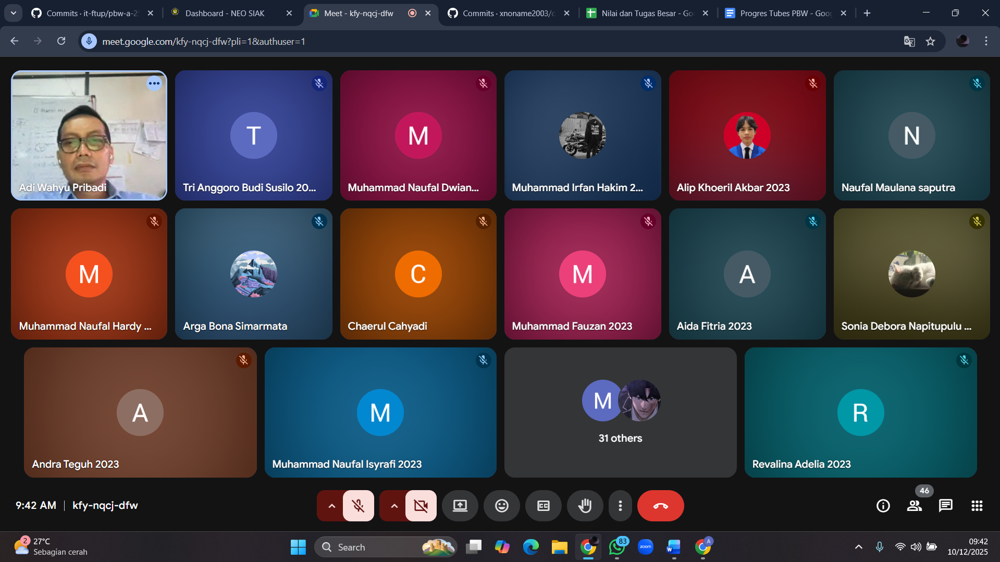

---
# Agenda Pekerjaan di GitHub

| No. | Nama               | Fitur                   | Deskripsi Progres                                                                                       | Tanggal Push GitHub |
|-----|--------------------|-------------------------|---------------------------------------------------------------------------------------------------------|----------- |
| 1.  | Chaerul Cahyadi    | Tidak Ada               | Inisialisasi Cafelora                                                                                   | 26/11/2025        |
| 2.  | Aditya Nur Lintang | Manajemen User dan Role | Setup Laravel + Filament, Implementasi Role + Policy (Admin, Staff, Customer)                           | 26/11/2025        |
| 3.  | Chaerul Cahyadi    | Tidak Ada               | Fix Error Implementasi Role Policy                                                                      | 27/11/2025        |
| 4.  | Chaerul Cahyadi    | Menu Management         | ERD dan Struktur Tabel Sistem Cafelora                                                                  | 29/11/2025        |
| 5.  | Chaerul Cahyadi    | Tidak Ada               | Update .env.example                                                                                     | 29/11/2025        |
| 6.  | Chaerul Cahyadi    | Tidak Ada               | Update Policy dan Crud Menu Management                                                                  | 30/11/2025        |
| 7.  | Chaerul Cahyadi    | Tidak Ada               | Fix Policy                                                                                              | 30/11/2025        |
| 8.  | Alip Khoeril Akbar | Frontend (Pelanggan)    | Membuat Frontend Untuk Pelanggan Melihat Daftar Menu dan Sedikit Penyesuaian Code Pada MenuResource.php | 30/11/2025        |
| 9.  | Chaerul Cahyadi    | Tidak Ada               | Update ERD Documentation and Replace Image                                                              | 6/12/2025        |
| 10. | Chaerul Cahyadi    | Tidak Ada               | Fix Landing Page and ERD                                                                                | 6/12/2025        |
| 11. | Alip Khoeril Akbar | Frontend (Pelanggan)    | Modifikasi Tampilan Frontend Pelanggan                                                                  | 6/12/2025        |
| 12. | Alip Khoeril Akbar | Frontend (Pelanggan)    | Membuat Fitur Search Pada Halaman Frontend (Pelanggan) Berdasarkan Nama menu, Harga, Kategori           | 7/12/2025        |
| 13. | Alip Khoeril Akbar | Frontend (Pelanggan)    | Membuat Fitur Search Pada Halaman Frontend (Pelanggan) Berdasarkan Nama menu, Harga, Kategori           | 8/12/2025        |
| 14. | Alip Khoeril Akbar | Frontend (Pelanggan)    | Fix URL Filter Frontend (Pelanggan)                                                                     | 10/12/2025        |

---
# Agenda Presentasi Progres Tugas Besar

| No. | Hari/Tanggal           | Presentasi ke-             | Hasil Progres                                                     |
|-----|------------------------|----------------------------|-------------------------------------------------------------------|
| 1.  | Rabu, 10 Desember 2025 | Presentasi Progres Pertama | Master Menu, Dashboard Filament, GitHub dan Branch sudah Berjalan |

---
# Bukti Dokumentasi Presentasi

## 1. Rabu, 10 Desember 2025 (Progres Pertama)

## 2. Rabu, 17 Desember 2025 (Progres Kedua)

---
# Rekap Uji Fungsionalitas & Status Progres Fitur

Bagian ini digunakan untuk mengetahui fitur apa saja yang *sudah selesai dan sudah diuji* serta fitur yang *masih dalam proses pengembangan*. Pengerjaan dimulai pada tanggal *26 November 2025* sampai saat ini.

## 1. Chaerul Cahyadi (Ketua): Struktur Proyek, Integrasi Transaksi, Dashboard, Review Fitur

| No. | Fitur yang Diuji                  | Deskripsi Uji                                                            | Status                                  | Tanggal Mulai     |
|-----|-----------------------------------|--------------------------------------------------------------------------|-----------------------------------------|-------------------|
| 1   | Struktur Proyek & Routing         | Mengecek konsistensi struktur folder, routing utama, dan manajemen modul | ✅ Selesai & Stabil                     | 26 November 2025  |
| 2   | Integrasi Logika Transaksi (Awal) | Memastikan relasi model transaksi & item berjalan awalnya                | 🔄 Dalam Progres (Bergantung POS Kasir) | 2-8 November 2025 |
| 3   | Dashboard Admin                   | Visualisasi dasar sudah tampil, grafik belum 100% data real-time         | 🔄 Dalam Progres                        | 2-8 November 2025 |
| 4   | Review & Validasi Fitur           | Pengecekan keseluruhan fitur anggota lain                                | 🔄 Berjalan Bertahap                    | 26 November 2025  |

## 2. Arya Wicaksana Putra: ERD, CRUD Master Data, Validasi Form, Upload Gambar

| No. | Fitur yang Diuji   | Deskripsi Uji                                                  | Status                       | Tanggal Mulai    |
|-----|--------------------|----------------------------------------------------------------|------------------------------|------------------|
| 1   | Desain ERD         | ERD diverifikasi dan konsisten dengan model Laravel            | ✅ Selesai                   | 26 November 2025 |
| 2   | CRUD Kategori      | Tambah, edit, hapus, dan list kategori berjalan baik           | ✅ Selesai & Berjalan Normal | 26 November 2025 |
| 3   | CRUD Topping       | Form & relasi topping berhasil disimpan                        | ✅ Selesai                   | 26 November 2025 |
| 4   | Validasi Form      | Field wajib terisi, format harga, dan input gambar tervalidasi | ✅ Selesai                   | 26 November 2025 |
| 5   | Upload Gambar Menu | Mengunggah gambar ke storage dan menampilkannya di card menu   | ✅ Selesai                   | 26 November 2025 |

## 3. Aditya Nur Lintang: Setup Laravel, Filament, Role, Policy, User Management

| No. | Fitur yang Diuji                | Deskripsi Uji                                            | Status                 | Tanggal Mulai    |
|-----|---------------------------------|----------------------------------------------------------|------------------------|------------------|
| 1   | Setup Laravel & Filament        | Proyek berhasil berjalan dan panel admin siap digunakan  | ✅ Selesai             | 26 November 2025 |
| 2   | Implementasi Role (Admin/Staff) | Pengujian akses halaman sesuai role                      | ✅ Selesai & Berfungsi | 26 November 2025 |
| 3   | Policy & Permission             | Staff dibatasi untuk akses tertentu (tanpa delete)       | ✅ Selesai             | 26 November 2025 |
| 4   | Manajemen User                  | CRUD user admin/staff berjalan optimal                   | ✅ Selesai             | 26 November 2025 |

## 4. Alip Khoeril Akbar: Frontend Pelanggan – Tampilan Menu & Filter

| No. | Fitur yang Diuji    | Deskripsi Uji                      | Status     | Tanggal Mulai    |
|-----|---------------------|------------------------------------|------------|------------------|
| 1   | Tampilan Grid Menu  | Card tampil responsif              | ✅ Selesai | 26 November 2025 |
| 2   | Filter Kategori     | Menu menyesuaikan pilihan kategori | ✅ Selesai | 26 November 2025 |
| 3   | Filter Varian       | Menu berganti sesuai varian        | ✅ Selesai | 26 November 2025 |
| 4   | Komponen Card Menu  | Gambar, nama, harga tampil baik    | ✅ Selesai | 26 November 2025 |
| 5   | Halaman Detail Menu | Informasi menu tampil lengkap      | ✅ Selesai | 26 November 2025 |
| 6   | Responsivitas UI    | Mobile & desktop tampak konsisten  | ✅ Selesai | 26 November 2025 |

## 5. Muhammad Fauzan: POS Kasir – Repeater Item, Perhitungan, Cetak Struk

| No. | Fitur yang Diuji          | Deskripsi Uji                                     | Status                   | Tanggal Mulai     |
|-----|---------------------------|---------------------------------------------------|--------------------------|-------------------|
| 1   | Tampilan Awal POS         | Repeater dasar tampil                             | ✅ UI Dasar Berjalan     | 2-8 November 2025 |
| 2   | Penambahan Item Transaksi | Penambahan baris item berhasil                    | 🟡 Perlu Logika Tambahan | 2-8 November 2025 |
| 3   | Dropdown Menu & Varian    | Dropdown tampil, harga belum sepenuhnya otomatis  | 🔄 Dalam Progres         | 2-8 November 2025 |
| 4   | Kalkulasi Total Otomatis  | Subtotal & total belum final                      | ⏳ Belum Selesai         | 2-8 November 2025 |
| 5   | Input Bayar & Kembalian   | Field muncul, logika backend belum lengkap        | 🔄 Dalam Progres         | 2-8 November 2025 |
| 6   | Cetak Struk HTML/PDF      | Template awal ada, belum final                    | 🔄 Dalam Progres         | 2-8 November 2025 |

## 6. Revalina Adelia: Laporan, Export PDF/Excel, Workflow Transaksi, Dokumentasi

| No. | Fitur yang Diuji           | Deskripsi Uji                                        | Status               | Tanggal Mulai     |
|-----|----------------------------|------------------------------------------------------|----------------------|-------------------|
| 1   | Halaman Laporan            | Tabel laporan tampil                                 | ✅ UI Dasar Berjalan | 2-8 November 2025 |
| 2   | Filter Laporan             | Filter tanggal & status belum terhubung backend      | 🔄 Dalam Progres     | 2-8 November 2025 |
| 3   | Export PDf/Excel           | Tombol tampil, backend belum final                   | 🔄 Dalam Progres     | 2-8 November 2025 |
| 4   | Workflow Status Transaksi  | Status pending → paid → completed belum terintegrasi | ⏳ Belum Selesai     | 2-8 November 2025 |
| 5   | Dokumentasi README         | Struktur sudah tersusun dan sedang diisi             | 🔄 Dalam Progres     | 2-8 November 2025 |

